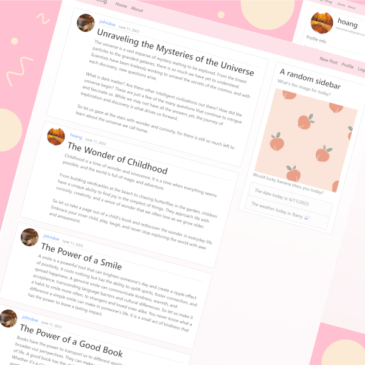

<div align="center">



# Django Blog

</div> 

---

## Contents
* [About](#about)
* [Specifications](#specifications)
* [Usages](#usages)
* [Notes](#notes)
* [References](#references)

---

<a name="about"></a>
## About
Django Blog - A Platform for Sharing Personal Experiences
- Implemented user authentication, user profiles, and a responsive homepage showcasing latest posts.
- Developed a user-friendly interface for creating, editing, and managing blog posts within the Django user profile panel.
- Successfully deployed the blog to Heroku (now discontinued free tier).

---

<a name="specifications"></a>
## Specifications
- A super basic Django blog, made for learning Django.

---

<a name="usages"></a>
## Usages
- Clone the repository.
- Run these to prepare dependencies:
    ```
    pip install -r requirements.txt
    python manage.py makemigrations
    python manage.py migrate
    python manage.py createsuperuser
    python manage.py runserver
    ```
- Access ```http://127.0.0.1:8000/``` in browser.

---

<a name="notes"></a>
## Notes
- Find in notes.txt for variables/usages.

---

<a name="references"></a>
## References
- Django [Documentation](https://docs.djangoproject.com/en/5.0/).
- Django [Tutorial](https://docs.djangoproject.com/en/5.0/)