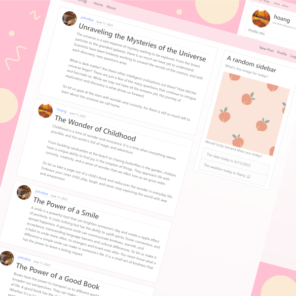

<div align="center">



# Django Blog

</div> 

## Contents
* [About](#about)
* [Packages](#packages)
* [References](#references)
* [Specifications](#specifications)
* [Installation](#installation)
* [Usages](#usages)
* [Notes](#notes)

<a name="about"></a>
## About
Django Blog - A Platform for Sharing Personal Experiences
- Implemented user authentication, user profiles, and a responsive homepage showcasing latest posts.

<a name="packages"></a>
## Packages

<a name="references"></a>
## References

<a name="specifications"></a>
## Specifications

<a name="installation"></a>
## Installation
```
python3 -m venv env
source env/Scripts/activate
pip install -r requirements.txt
```  

<a name="usages"></a>
## Usages

<a name="notes"></a>
## Notes
- <ins>Add</ins>: 
